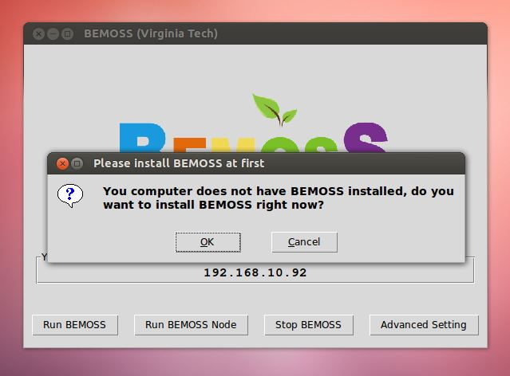
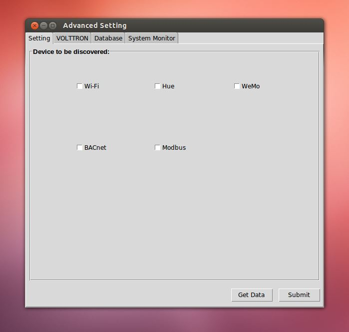
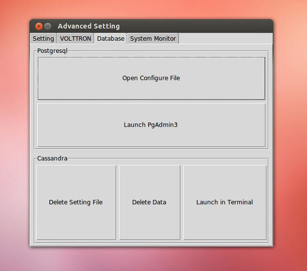
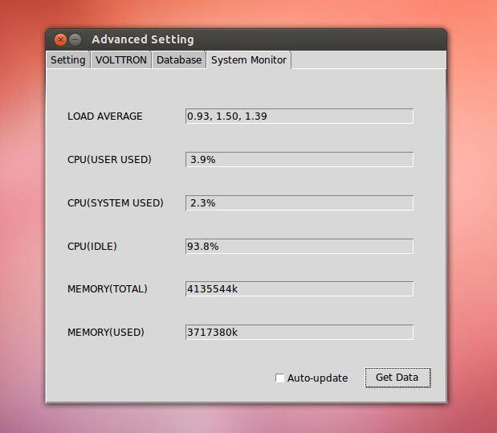

# BEMOSS GUI DEMO

# Dependencies:
## ImageTK is needed:   *sudo apt-get install python-imaging-tk*   *sudo apt-get install python-netifaces*
When double click startBEMOSS_GUI.sh, these dependencies will be installed automatically.
 

# Main Panel

## From Main Panel, you can:

- Find out web server IP
- Run BEMOSS
- Stop BEMOSS
- Go to Advanced Setting

## If BEMOSS is not installed, click any of these three buttons will prompt with BEMOSS installation request. Click OK to install BEMOSS.

# Tab1: Setting

## Setting tab is mainly designed for selecting devices to be discovered before BEMOSS starts running.
- Get Data: When press this button, what is currently on settings.py will be showed on UI;
- Submit: After changes have been made, click submit will change the content of settings.py.

# Tab2: VOLTTRON

## This tab mainly designed for VOLTTRON interaction.
- View Agent Status: click this button to display agents' status, first time click might need system password.
- Start/Stop Agents: Individual agents can be stopped or started here, specify the agent ID in the blank.
- Agent Repackage: Agent code can be repackaged by one click: first all agents belong to the type of agent needs to be repackaged will stop, then agent code repackage, finally agents start.

# Tab 3: Database

## This tab cope with database related issue, it is divided by two sections: one for Postgresql, one for Cassandra:
- Open configuration files of Postgresql: both postgresql.conf and pg_hba.conf will be open by either gedit or leafpad, system password might be needed
- Start Pgadmin3
- Delete Cassandra setting's file in bemoss_os folder
- Delete Cassandra data
- Connect to Cassandra in terminal, Cassandra log in information will be needed.

# Tab 4: System Monitoring

- Average Load/CPU/Memory information will be displayed, support auto update.
